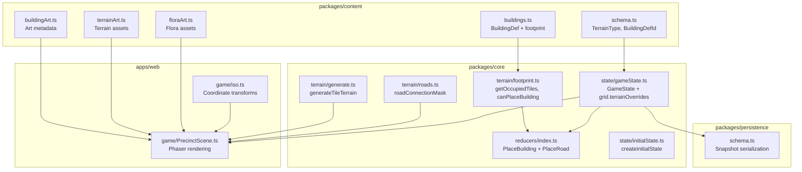
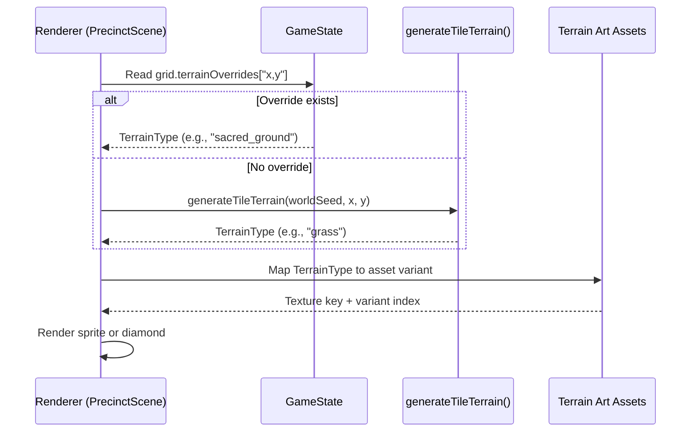
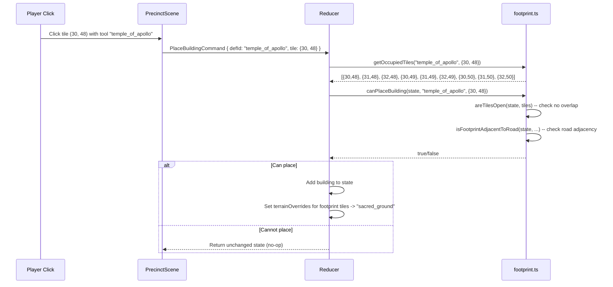
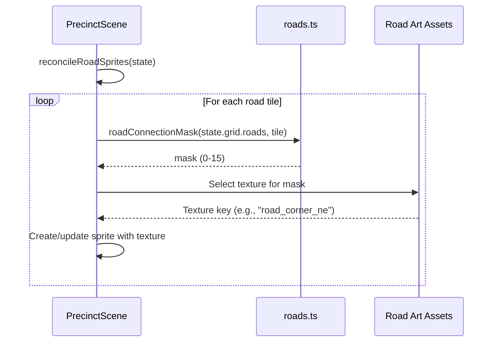

# Map & Rendering Overhaul Plan

**Status:** proposed
**Date:** 2026-03-09

---

## Table of Contents

1. [Architecture Decision Records](#architecture-decision-records)
2. [Phase 1: Per-Tile Terrain Data + Procedural Generation](#phase-1-per-tile-terrain-data--procedural-generation)
3. [Phase 2: Multi-Tile Building Footprints + Collision Detection](#phase-2-multi-tile-building-footprints--collision-detection)
4. [Phase 3: Road Auto-Tiling + Connectivity](#phase-3-road-auto-tiling--connectivity)
5. [Phase 4: Placement Validation + Ghost Preview](#phase-4-placement-validation--ghost-preview)
6. [Data Model](#data-model)
7. [Migration Strategy](#migration-strategy)
8. [System Diagrams](#system-diagrams)

---

## Architecture Decision Records

### ADR-1: Terrain Data Location (Core State vs. Render-Time Derivation)

**Status:** proposed

**Context:**
Currently, terrain is derived entirely at render time inside `PrecinctScene.buildTerrainContext()`. There is no per-tile data in the game state -- the `grid` object contains only `width`, `height`, and `roads: Coord[]`. The question is whether per-tile terrain data should live in the core `GameState` (persisted, deterministic) or remain a render-time concern.

**Options Considered:**

1. **Per-tile array in `GameState.grid`** -- A flat array (`tiles: TileData[]`) of width*height entries stored in core state and persisted in saves. Terrain generation runs once at world creation and the result is authoritative.
   - Pros: Deterministic, inspectable by game logic (walkers could path differently on rock vs. grass), testable in core package without Phaser.
   - Cons: Increases save file size (~60*60 = 3,600 entries), migration needed for existing saves.

2. **Seed-derived terrain computed on demand** -- Terrain is a pure function of `worldSeed` + tile coordinates. No storage. Recomputed whenever needed.
   - Pros: Zero save size impact, no migration, always consistent.
   - Cons: Requires deterministic noise function available in both core and web packages. Harder to let the player terraform or for game events to alter terrain. Must re-derive the same noise values in multiple call sites.

3. **Hybrid: seed-derived base + sparse overlay in state** -- Base terrain is always seed-derived. A sparse `terrainOverrides: Record<string, TerrainType>` in state stores only tiles that differ from the seed-derived default (e.g., cleared trees, paved areas).
   - Pros: Tiny save footprint, seed-deterministic base, still supports dynamic changes.
   - Cons: More complex lookup logic (check override, then fall back to seed). Two code paths to maintain.

**Decision:** Option 3 -- Hybrid seed-derived base with sparse overlay.

**Rationale:** A 60x60 grid is small enough that even Option 1 would be fine for save size, but the hybrid approach gives us the best of both worlds: zero migration cost for existing saves (they simply have no overrides, so everything is seed-derived), deterministic reproducibility, and a path to future terraforming. The noise function is a simple seeded hash -- no external dependency needed.

**Consequences:**
- New pure function `generateTerrain(seed: number, x: number, y: number): TerrainType` in core package.
- New optional field `grid.terrainOverrides` in `GameState`.
- `PrecinctScene.buildTerrainContext()` will call the terrain function instead of its current heuristic derivation.
- Existing saves load with empty overrides; terrain is generated from their existing `worldSeed`.

---

### ADR-2: Building Footprint Enforcement Location

**Status:** proposed

**Context:**
Building footprints are defined in `buildingArt.ts` (content package) as strings like "2x2", "3x2", "landmark", "tile_kit". Currently, the `isTileOpen` check in the reducer only tests the single placement tile against roads and building positions. Multi-tile footprints are only used for sprite scaling in the renderer. The question is where footprint data should be authoritative and how occupation should be tracked.

**Options Considered:**

1. **Store occupied tiles per building in `BuildingInstance`** -- Add `occupiedTiles: Coord[]` to each `BuildingInstance`. The reducer computes occupied tiles from the footprint at placement and stores them. Collision checks iterate all buildings' occupied tiles.
   - Pros: Explicit, easy to query, no footprint lookup needed after placement.
   - Cons: Redundant data (derivable from position + footprint), increases save size per building, migration needed.

2. **Derive occupied tiles from position + footprint at query time** -- Add a pure function `getOccupiedTiles(defId, position): Coord[]` that uses the footprint definition. Collision detection calls this function for every existing building.
   - Pros: No state change, no migration, single source of truth.
   - Cons: Requires footprint data accessible in core package (currently only in content). O(n) scan per placement check.

3. **Occupation bitmap in grid state** -- A `Set<string>` or flat boolean array tracking which tiles are occupied. Updated on building place/remove.
   - Pros: O(1) collision check.
   - Cons: Derived state stored authoritatively -- can desync if a building is removed without clearing the bitmap. Harder to debug.

**Decision:** Option 2 -- Derive occupied tiles at query time.

**Rationale:** With at most ~40 buildings on a 60x60 grid, O(n) scan is negligible. This approach requires no state migration and no redundant data. The footprint definitions need to move from being purely art metadata to being accessible as game logic. We will add a `footprint` field to `BuildingDef` in the content package's `buildings.ts` (not just `buildingArt.ts`), making it the authoritative source. The art metadata's footprint string is already consistent with this.

**Consequences:**
- New `footprint: { width: number; height: number }` field on `BuildingDef` in `packages/content/src/schema.ts`.
- New pure function `getOccupiedTiles(defId: BuildingDefId, origin: Coord): Coord[]` in core package.
- `isTileOpen` in the reducer expands to check all occupied tiles of all existing buildings.
- The "landmark" footprint maps to 4x3 (the largest building sprite footprint).
- Existing saves are unaffected -- no state shape change. Overlap detection is retroactive: any future placements are checked, but existing overlapping buildings (if any) remain.

---

### ADR-3: Road Auto-Tiling Strategy

**Status:** proposed

**Context:**
Roads are stored as `Coord[]`. Each road tile is rendered as an individual "sacred_way" sprite. There is no awareness of neighboring road tiles, so all road tiles look identical regardless of whether they form a straight line, corner, T-junction, or crossroad. The sacred_way_kit asset exists as a single 96x96 sprite.

**Options Considered:**

1. **Bitmask-based auto-tiling with sub-frame selection** -- Assign each road tile a 4-bit bitmask based on which of its 4 cardinal neighbors are also roads. The bitmask (0-15) selects a visual variant. Requires 16 road sprite variants (or a spritesheet).
   - Pros: Industry-standard approach, deterministic, fast lookup.
   - Cons: Requires 16 distinct road art assets (currently have 1).

2. **Procedural road rendering via Graphics primitives** -- Draw road connections as thick lines/arcs between adjacent road tile centers using Phaser Graphics.
   - Pros: No new art assets needed, infinitely flexible.
   - Cons: Looks worse than sprites, inconsistent with the pixel art style, harder to get right.

3. **Single sprite + rotation/flip** -- Use the existing sacred_way_kit sprite and rotate/flip it based on neighbor connections. A straight road uses 0/90 degree rotation; corners use the sprite at 0/90/180/270.
   - Pros: Fewer art assets (4-6 variants instead of 16), pragmatic.
   - Cons: Isometric rotation is not simply a 90-degree canvas rotation -- the diamond shape means N-S and E-W are visually different. Still needs at least distinct straight/corner/T/cross variants.

**Decision:** Option 1 -- Bitmask auto-tiling.

**Rationale:** This is the standard approach for tile-based games and produces the best visual result. The sacred_way_kit asset at 96x96 is sized to accommodate a small spritesheet, and new road variants can be generated using the same art pipeline that produced the existing asset. The bitmask lookup is O(1) and the logic is trivially testable.

**Consequences:**
- Need 5-16 road art variants (at minimum: isolated, straight-NS, straight-EW, corner x4, T x4, cross = 12 distinct). Can start with fewer by mapping uncommon bitmasks to the nearest visual.
- New `roadConnectionMask(roads: Coord[], tile: Coord): number` function in core.
- Road sprite reconciliation in `PrecinctScene` changes from single texture to bitmask-selected texture.
- Art generation is a prerequisite (or stub with colored diamonds until art is ready).
- **Assumption:** Art pipeline can produce these variants. If not, Option 2 can serve as a temporary fallback.

---

## Phase 1: Per-Tile Terrain Data + Procedural Generation

### Goal
Replace the flat diamond checkerboard with a varied, natural-looking landscape generated deterministically from the world seed. Rocks, trees, elevation hints, water features, and grass should appear across the map.

### Files Changed

| Package | File | Change |
|---------|------|--------|
| `core` | `src/state/gameState.ts` | Add `TerrainType` type, add optional `terrainOverrides` to `grid` |
| `core` | `src/terrain/generate.ts` | **NEW** -- `generateTileTerrain(seed, x, y): TerrainType` pure function |
| `core` | `src/terrain/index.ts` | **NEW** -- barrel export |
| `core` | `src/state/initialState.ts` | No change needed (overrides default to undefined/empty) |
| `content` | `src/schema.ts` | Add `TerrainType` union export |
| `web` | `src/game/PrecinctScene.ts` | Replace `buildTerrainContext` terrain derivation with calls to `generateTileTerrain`. Replace `terrainBoardStyle` diamond colors with terrain-type-to-sprite mapping. Replace `drawTerrainDiamond` with sprite-based terrain tiles. |
| `persistence` | `src/schema.ts` | Add `terrainOverrides` to snapshot normalization (optional field, default `{}`) |

### New Types

```typescript
// In packages/content/src/schema.ts (or core/src/terrain/types.ts)
export type TerrainType =
  | "grass"           // Default open ground
  | "dry_earth"       // Arid patches
  | "limestone"       // Rocky flat terrace
  | "cliff"           // Impassable rock face (map edges, elevation)
  | "water"           // Spring pools, streams
  | "scrub"           // Low bushes, visual only
  | "forest"          // Dense tree cover
  | "sacred_ground"   // Near-temple paved area (set by override when buildings placed)
  | "road";           // Road surface (set by override when road placed)
```

```typescript
// Addition to GameState.grid
grid: {
  width: number;
  height: number;
  roads: Coord[];
  terrainOverrides?: Record<string, TerrainType>; // key = "x,y"
};
```

### Terrain Generation Algorithm

```typescript
// packages/core/src/terrain/generate.ts
//
// Seeded hash -> terrain type mapping.
// Uses the world seed to produce deterministic terrain.
// Algorithm:
//   1. Hash (seed, x, y) to a float 0..1 using a simple integer hash.
//   2. Use distance from map center and edge proximity for biome zones.
//   3. Map zones + noise to terrain types.
//
// Zone layout (for 60x60 grid):
//   - Outer 3-tile ring: cliff / forest edge
//   - Rows 0-8 (north): elevated, more cliff/rock
//   - Central band (rows 15-45): buildable, mostly grass/dry_earth/limestone
//   - South fringe (rows 50+): lower, more water features
//   - Scattered features: rock outcrops, tree clusters via noise thresholds
//
// The existing flora placement in PrecinctScene (cypress, shrubs, etc.)
// will read terrain type to decide density/placement instead of the
// current proximity heuristic.
```

### Rendering Changes

The current `drawTerrainDiamond()` draws colored diamonds. The new approach:

1. For each tile `(x, y)`, resolve terrain type: `grid.terrainOverrides["x,y"] ?? generateTileTerrain(seed, x, y)`.
2. Map terrain type to an existing terrain art asset:
   - `grass` -> `dry_earth` variants (v1-v4) with green tint, or `limestone_terrace` variants
   - `dry_earth` -> `dry_earth` variants (v1-v4)
   - `limestone` -> `limestone_terrace` variants (v1-v4)
   - `cliff` -> `cliff_edge`
   - `water` -> `spring_pool`
   - `scrub` -> `dry_earth` + flora sprite overlay
   - `forest` -> `dry_earth` + cypress/shrub flora overlay
   - `sacred_ground` -> `sacred_paving` variants
   - `road` -> `sacred_paving` variants (handled by road layer)
3. Use the existing `terrainSprites` Map for reconciliation. Select variant using `(seed + x * 7 + y * 13) % variantCount` for deterministic visual variety.
4. Keep the diamond fallback for tiles outside the sprite coverage (distant tiles rendered as colored diamonds for performance).

### What Stays the Same

- The `buildTerrainContext` function's purpose (computing decoration zones around buildings) remains, but it stops being the source of terrain identity. It becomes a secondary layer that adds "sacred_ground" overrides around ritual buildings.
- Flora placement (`buildFloraPlacements`) adapts to read terrain type: forest tiles get cypress trees, scrub tiles get shrubs, grass tiles get dry_grass_cluster.

### Verification Criteria

- [ ] `generateTileTerrain(seed, x, y)` is deterministic: same seed + coords always produce same terrain type.
- [ ] Two different seeds produce visually distinct maps.
- [ ] All 25 existing tests in `packages/core/tests/` pass without modification.
- [ ] Persistence round-trip works: save with `terrainOverrides`, load, overrides intact.
- [ ] Existing saves (no `terrainOverrides` field) load correctly, terrain generates from seed.
- [ ] Map edges have natural boundaries (cliff/forest), center is buildable.
- [ ] No visual regression for the "empty map" state (no buildings/roads placed yet).
- [ ] Flora sprites appear on appropriate terrain types.

---

## Phase 2: Multi-Tile Building Footprints + Collision Detection

### Goal
Buildings occupy their defined footprint area. A "2x2" building placed at (30, 49) occupies (30,49), (31,49), (30,50), (31,50). Placement fails if any of those tiles is already occupied by another building or road.

### Files Changed

| Package | File | Change |
|---------|------|--------|
| `content` | `src/schema.ts` | Add `footprint?: { width: number; height: number }` to `BuildingDef` type |
| `content` | `src/buildings.ts` | Add `footprint` to each building definition |
| `core` | `src/terrain/footprint.ts` | **NEW** -- `getOccupiedTiles(defId, origin)`, `parseFootprint(footprintStr)` |
| `core` | `src/reducers/index.ts` | Replace `isTileOpen` with footprint-aware `areTilesOpen`. Update `PlaceBuildingCommand` handler. |
| `core` | `src/simulation/updateDay.ts` | Update `createBuildingAt` if it references single-tile logic |
| `web` | `src/game/PrecinctScene.ts` | Update building click detection to check all occupied tiles. Update `buildTerrainContext` to register all occupied tiles. Update shadow/halo rendering for multi-tile buildings. |

### New Types and Functions

```typescript
// packages/core/src/terrain/footprint.ts

export type Footprint = { width: number; height: number };

/** Parse "2x2" -> { width: 2, height: 2 }. "landmark" -> { width: 4, height: 3 }. "1x1" default. */
export function parseFootprint(footprintStr: string): Footprint;

/**
 * Returns all tiles occupied by a building of the given defId placed at origin.
 * Origin is the top-left tile (lowest x, lowest y) of the footprint.
 *
 * For a 2x2 building at (30, 49):
 *   [(30,49), (31,49), (30,50), (31,50)]
 */
export function getOccupiedTiles(defId: BuildingDefId, origin: Coord): Coord[];

/**
 * Check if all tiles for a proposed building placement are free.
 */
export function canPlaceBuilding(
  state: GameState,
  defId: BuildingDefId,
  origin: Coord
): boolean;
```

### Footprint Mapping

Derived from the existing `buildingArt.ts` footprint strings:

| Footprint String | Parsed Size | Buildings |
|-----------------|-------------|-----------|
| `"1x1"` | 1x1 | eternal_flame_brazier, omphalos_stone |
| `"1x2"` | 1x2 | purification_font, votive_offering_rack |
| `"2x2"` | 2x2 | Most buildings (animal_pen, buried_chamber, castalian_spring, etc.) |
| `"3x2"` | 3x2 | agora_market, bath_house, grain_field, olive_grove, etc. |
| `"3x3"` | 3x3 | temple_of_apollo, temple_of_athena, temple_of_hermes, theater, tholos |
| `"landmark"` | 4x3 | excavation_trench, quarry |
| `"tile_kit"` | 1x1 | sacred_way_kit (roads, handled separately) |

### Reducer Changes

```typescript
// Current:
function isTileOpen(state: GameState, tile: { x: number; y: number }): boolean {
  const roadTaken = state.grid.roads.some((road) => coordEquals(road, tile));
  const buildingTaken = state.buildings.some((building) => coordEquals(building.position, tile));
  return !roadTaken && !buildingTaken;
}

// New:
function areTilesOpen(state: GameState, tiles: Coord[]): boolean {
  const roadSet = new Set(state.grid.roads.map((r) => `${r.x},${r.y}`));
  const occupiedSet = new Set<string>();
  for (const building of state.buildings) {
    for (const tile of getOccupiedTiles(building.defId, building.position)) {
      occupiedSet.add(`${tile.x},${tile.y}`);
    }
  }
  return tiles.every((tile) => {
    const key = `${tile.x},${tile.y}`;
    return !roadSet.has(key)
      && !occupiedSet.has(key)
      && tile.x >= 0 && tile.x < state.grid.width
      && tile.y >= 0 && tile.y < state.grid.height;
  });
}
```

### Renderer Impact

- `buildTerrainContext()`: Change `buildingKeys` from single position to all occupied tiles per building. This makes the limestone terrace / sacred paving underlay appear beneath the full footprint, not just the origin tile.
- Building click detection: Currently checks `building.position.x === tile.x && building.position.y === tile.y`. Must check if the clicked tile falls within any building's footprint.
- Building shadows: Ellipse shadow under buildings should scale with footprint size.
- Building sprite positioning: The sprite anchor point changes. For a 3x2 building, the sprite should be centered on the footprint's isometric center, not the origin tile.

### Existing Test Impact

The reducer test `"places roads and then buildings adjacent to them"` places `priest_quarters` at (30, 49). With a 2x2 footprint, this occupies (30,49), (31,49), (30,50), (31,50). The road is at (30, 50) -- **this would conflict**. The test needs adjustment:

**Test adjustment strategy:** The road at (30, 50) is within the 2x2 footprint of a building at (30, 49). Two options:
- A) Adjust the test tile coords so building and road don't overlap.
- B) Define "origin" such that the building occupies tiles that don't include the road tile.

**Recommendation:** Adjust test coords. Place road at (30, 50), building at (30, 48). The 2x2 footprint of priest_quarters at (30, 48) = [(30,48), (31,48), (30,49), (31,49)]. Tile (30, 49) is adjacent to road (30, 50). This preserves the test's intent.

This is a minimal change. The test for "requires Sacred Way before buildings" is unaffected. The "folds building startup stock" test and "keeps event feed ids unique" test also need coord adjustments for the same reason.

### Verification Criteria

- [ ] `getOccupiedTiles("priest_quarters", { x: 30, y: 49 })` returns 4 tiles for a 2x2 building.
- [ ] Placing a 3x3 temple blocks all 9 tiles from future placement.
- [ ] Attempting to place a building where any footprint tile overlaps an existing building or road is rejected.
- [ ] Attempting to place a building that would extend beyond grid bounds is rejected.
- [ ] All adjusted tests pass.
- [ ] Building click detection works for clicking any tile within a multi-tile building's footprint.
- [ ] Terrain underlay renders beneath the full footprint.
- [ ] Building sprite is visually centered on its footprint.

---

## Phase 3: Road Auto-Tiling + Connectivity

### Goal
Sacred Way road tiles form visually connected paths. Each road tile's appearance reflects its connections to neighboring road tiles (straight, corner, T-junction, crossroad).

### Files Changed

| Package | File | Change |
|---------|------|--------|
| `core` | `src/terrain/roads.ts` | **NEW** -- `roadConnectionMask(roads, tile): number`, `describeRoadShape(mask): string` |
| `content` | `src/generated/buildingArt.ts` | Add road variant entries (or a dedicated road art mapping) |
| `web` | `src/game/PrecinctScene.ts` | Update `reconcileRoadSprites` to select texture based on connection mask |
| `web` | `public/assets/precinct/buildings/` | New road variant PNGs (or generated programmatically) |

### Connection Mask

```typescript
// 4-bit bitmask: NORTH=1, EAST=2, SOUTH=4, WEST=8
// In isometric space:
//   "North" = tile at (x, y-1)
//   "East"  = tile at (x+1, y)
//   "South" = tile at (x, y+1)
//   "West"  = tile at (x-1, y)

export function roadConnectionMask(roads: Coord[], tile: Coord): number {
  const roadSet = new Set(roads.map((r) => `${r.x},${r.y}`));
  let mask = 0;
  if (roadSet.has(`${tile.x},${tile.y - 1}`)) mask |= 1;  // N
  if (roadSet.has(`${tile.x + 1},${tile.y}`)) mask |= 2;   // E
  if (roadSet.has(`${tile.x},${tile.y + 1}`)) mask |= 4;   // S
  if (roadSet.has(`${tile.x - 1},${tile.y}`)) mask |= 8;   // W
  return mask;
}
```

### Visual Mapping (16 possible masks)

| Mask | Binary | Shape | Asset ID |
|------|--------|-------|----------|
| 0 | 0000 | Isolated | `road_isolated` |
| 1 | 0001 | Dead-end N | `road_end_n` |
| 2 | 0010 | Dead-end E | `road_end_e` |
| 3 | 0011 | Corner NE | `road_corner_ne` |
| 4 | 0100 | Dead-end S | `road_end_s` |
| 5 | 0101 | Straight NS | `road_straight_ns` |
| 6 | 0110 | Corner SE | `road_corner_se` |
| 7 | 0111 | T-junction NSE | `road_t_nse` |
| 8 | 1000 | Dead-end W | `road_end_w` |
| 9 | 1001 | Corner NW | `road_corner_nw` |
| 10 | 1010 | Straight EW | `road_straight_ew` |
| 11 | 1011 | T-junction NEW | `road_t_new` |
| 12 | 1100 | Corner SW | `road_corner_sw` |
| 13 | 1101 | T-junction NSW | `road_t_nsw` |
| 14 | 1110 | T-junction SEW | `road_t_sew` |
| 15 | 1111 | Crossroad | `road_cross` |

**Fallback strategy:** Until all 16 art variants exist, map dead-ends to isolated, map T-junctions to the nearest corner+straight combo. Minimum viable set: isolated (0), straight-NS (5), straight-EW (10), cross (15), plus 4 corners (3,6,9,12) = 8 assets.

### Art Prerequisite

This phase has an **art dependency**. The existing `sacred_way_kit.png` is a single variant. New road variants must be produced. Options:
- Use the existing art pipeline to generate variants.
- As a temporary measure, render roads as colored diamonds with directional line overlays using Phaser Graphics (no new art).

**Recommendation:** Implement the bitmask logic and texture selection now. Use the existing `sacred_way_kit` sprite for all masks initially (no visual regression). Create an art task to produce variants as a parallel workstream. When variants ship, they slot in with zero code changes.

### Verification Criteria

- [ ] `roadConnectionMask` returns correct bitmask for all 16 configurations.
- [ ] Placing a road updates the visual of all its neighbors (their masks change).
- [ ] A straight line of roads renders as connected straight segments.
- [ ] An L-shaped road renders with a corner piece at the bend.
- [ ] Unit tests for `roadConnectionMask` cover isolated, straight, corner, T, cross cases.
- [ ] No visual regression when using the single sacred_way_kit fallback.

---

## Phase 4: Placement Validation + Ghost Preview

### Goal
When the player selects a building tool and hovers over the map, show a translucent ghost preview of the building footprint. Green tiles = valid placement; red tiles = blocked. Enforce road adjacency: at least one tile of the building's footprint must be cardinally adjacent to a road tile.

### Files Changed

| Package | File | Change |
|---------|------|--------|
| `core` | `src/terrain/footprint.ts` | Add `isFootprintAdjacentToRoad(state, defId, origin): boolean` |
| `core` | `src/reducers/index.ts` | `PlaceBuildingCommand` uses `canPlaceBuilding` which includes adjacency check |
| `web` | `src/game/PrecinctScene.ts` | Add ghost preview rendering in `drawState`. When `activeTool` is a building defId and `hoveredTile` is set, draw the footprint overlay. |

### Ghost Preview Rendering

```
// In drawState(), after terrain/buildings are drawn:
if (activeTool !== "select" && activeTool !== "sacred_way" && hoveredTile) {
  const tiles = getOccupiedTiles(activeTool, hoveredTile);
  const canPlace = canPlaceBuilding(state, activeTool, hoveredTile);
  const color = canPlace ? 0x4da06e : 0xc45540;  // green or red
  const alpha = 0.35;
  for (const tile of tiles) {
    const screen = tileToScreen(tile);
    drawDiamond(overlayGraphics, screen.x, screen.y, color, alpha);
  }
}
```

### Road Adjacency Rule

```typescript
export function isFootprintAdjacentToRoad(
  state: GameState,
  defId: BuildingDefId,
  origin: Coord
): boolean {
  const occupied = getOccupiedTiles(defId, origin);
  const roadSet = new Set(state.grid.roads.map((r) => `${r.x},${r.y}`));
  return occupied.some((tile) =>
    roadSet.has(`${tile.x},${tile.y - 1}`) ||
    roadSet.has(`${tile.x + 1},${tile.y}`) ||
    roadSet.has(`${tile.x},${tile.y + 1}`) ||
    roadSet.has(`${tile.x - 1},${tile.y}`)
  );
}
```

This replaces the current `isAdjacentToRoad` which only checks the origin tile. Now any tile in the footprint being adjacent to a road satisfies the requirement.

### Road Tool Preview

When `activeTool === "sacred_way"` and `hoveredTile` is set, show a single-tile green/red diamond at the hover position:
- Green if the tile is not occupied.
- Red if occupied.
- Additionally, if placing this road would connect to an existing road, show a subtle line/glow between them.

### Verification Criteria

- [ ] Ghost preview appears when a building tool is active and mouse hovers over the grid.
- [ ] Preview footprint matches the building's actual size (2x2 shows 4 diamonds, 3x3 shows 9).
- [ ] Green when all tiles are free and at least one is adjacent to a road.
- [ ] Red when any tile is occupied or no tile is adjacent to a road.
- [ ] Preview disappears when tool is "select".
- [ ] `connectedToRoad` field on `BuildingInstance` is set correctly using the new adjacency logic.
- [ ] Existing test "requires Sacred Way before buildings can be placed" still passes.

---

## Data Model

### Terrain Types

| Entity | Field | Type | Constraints | Notes |
|--------|-------|------|-------------|-------|
| TerrainType | (union) | string literal | One of: grass, dry_earth, limestone, cliff, water, scrub, forest, sacred_ground, road | Core terrain classification |

### Grid State Changes

| Entity | Field | Type | Constraints | Notes |
|--------|-------|------|-------------|-------|
| GameState.grid | width | number | > 0 | Unchanged |
| GameState.grid | height | number | > 0 | Unchanged |
| GameState.grid | roads | Coord[] | | Unchanged |
| GameState.grid | terrainOverrides | Record<string, TerrainType> | Optional, default {} | **NEW.** Key = "x,y". Only stores tiles that differ from seed-derived terrain. |

### BuildingDef Changes

| Entity | Field | Type | Constraints | Notes |
|--------|-------|------|-------------|-------|
| BuildingDef | footprint | { width: number; height: number } | width >= 1, height >= 1 | **NEW.** Parsed from art metadata footprint string. |

### Footprint Sizes

| BuildingDefId | Footprint | Tile Count |
|---------------|-----------|------------|
| sacred_way | 1x1 | 1 (road, special) |
| eternal_flame_brazier | 1x1 | 1 |
| omphalos_stone | 1x1 | 1 |
| purification_font | 1x2 | 2 |
| votive_offering_rack | 1x2 | 2 |
| priest_quarters | 2x2 | 4 |
| storehouse | 2x2 | 4 |
| castalian_spring | 2x2 | 4 |
| inner_sanctum | 2x2 | 4 |
| sacrificial_altar | 2x2 | 4 |
| animal_pen | 2x2 | 4 |
| granary | 2x2 | 4 |
| kitchen | 2x2 | 4 |
| olive_press | 2x2 | 4 |
| incense_store | 2x2 | 4 |
| incense_workshop | 2x2 | 4 |
| scriptorium | 2x2 | 4 |
| library | 2x2 | 4 |
| agora_market | 3x2 | 6 |
| xenon | 3x2 | 6 |
| grain_field | 3x2 | 6 |
| olive_grove | 3x2 | 6 |
| papyrus_reed_bed | 3x2 | 6 |
| temple_of_apollo | 3x3 | 9 |
| temple_of_athena | 3x3 | 9 |
| temple_of_hermes | 3x3 | 9 |
| theater | 3x3 | 9 |
| tholos | 3x3 | 9 |
| excavation_trench | 4x3 | 12 |
| quarry | 4x3 | 12 |

---

## Migration Strategy

### Existing Save Compatibility

All changes are **additive and optional**:

1. **`grid.terrainOverrides`**: New optional field. Old saves don't have it. The deserializer in `packages/persistence/src/schema.ts` already backfills missing fields against the baseline state. Add:
   ```typescript
   if (!isRecord(grid.terrainOverrides)) {
     grid.terrainOverrides = {};
   }
   ```
   With empty overrides, terrain generates entirely from `worldSeed`.

2. **`BuildingDef.footprint`**: This is content-package data, not persisted state. No migration needed.

3. **Building overlap in existing saves**: Existing saves may have buildings placed at overlapping positions (since overlap wasn't prevented). We do NOT retroactively fix these. The new collision detection only applies to future placements. If we want to warn about existing overlaps, that's a separate UI concern.

4. **`GameSnapshot.version`**: Remains at `1`. The changes are backward-compatible -- no version bump needed. The deserialization code handles the new optional fields gracefully.

### Test Migration

Only 3-4 tests in `packages/core/tests/reducer.test.ts` need coordinate adjustments to avoid the new footprint overlap rules. Specifically, any test that places a 2x2 building adjacent to a road must ensure the building's footprint doesn't overlap the road tile.

---

## System Diagrams

### Component Architecture



### Terrain Resolution Flow



### Building Placement Flow



### Road Auto-Tile Flow



---

## Implementation Order and Dependencies

```
Phase 1 (Terrain)
  |
  v
Phase 2 (Footprints) --- depends on Phase 1 for terrain overrides
  |
  v
Phase 3 (Road Auto-Tile) --- independent of Phase 2, can parallelize
  |
  v
Phase 4 (Ghost Preview) --- depends on Phase 2 (footprint functions)
```

**Phase 1** and **Phase 3** are largely independent and could be developed in parallel.
**Phase 2** must come before **Phase 4** (ghost preview needs footprint calculation).
**Phase 2** benefits from Phase 1 (so building footprints set terrain overrides), but could be implemented first with a simpler terrain fallback.

### Estimated Scope

| Phase | New Files | Modified Files | New Tests | Risk |
|-------|-----------|---------------|-----------|------|
| 1 | 2 (terrain/generate.ts, terrain/index.ts) | 3 (gameState.ts, PrecinctScene.ts, persistence/schema.ts) | 5-8 | Low -- additive, optional field |
| 2 | 1 (terrain/footprint.ts) | 4 (schema.ts, buildings.ts, reducers/index.ts, PrecinctScene.ts) | 8-12 | Medium -- test adjustments needed, renderer refactor |
| 3 | 1 (terrain/roads.ts) | 2 (PrecinctScene.ts, buildingArt.ts) | 4-6 | Low -- art dependency but fallback strategy exists |
| 4 | 0 | 2 (footprint.ts, PrecinctScene.ts) | 3-5 | Low -- purely additive rendering |

### Assumptions

1. The 60x60 grid size is final and will not change significantly.
2. Building `position` represents the top-left (minimum x, minimum y) tile of the footprint.
3. The `sacred_way` building definition is treated as a 1x1 road tile, not a regular building.
4. "landmark" footprint (excavation_trench, quarry) maps to 4x3 tiles. This is an assumption based on sprite size ratios. **Spike recommended** to confirm the intended footprint for landmark buildings.
5. The art pipeline can produce road variants. If not, the Graphics-based fallback is acceptable as a temporary measure.
6. Existing saves with overlapping buildings are tolerated (no retroactive fix).
7. Terrain generation does not need to consider game-mechanical effects (e.g., movement speed by terrain type) in Phase 1. This is purely visual.

---

## Handoffs

- **Backend (core package):** `terrain/generate.ts`, `terrain/footprint.ts`, `terrain/roads.ts`, reducer changes, gameState type changes.
- **Frontend (web app):** `PrecinctScene.ts` rendering changes, ghost preview, terrain sprite reconciliation.
- **Art:** 8-16 road variant sprites, potential terrain tile improvements.
- **QA:** Test adjustments in `reducer.test.ts`, new unit tests for terrain gen / footprint / road mask, visual regression testing for all 4 phases.
